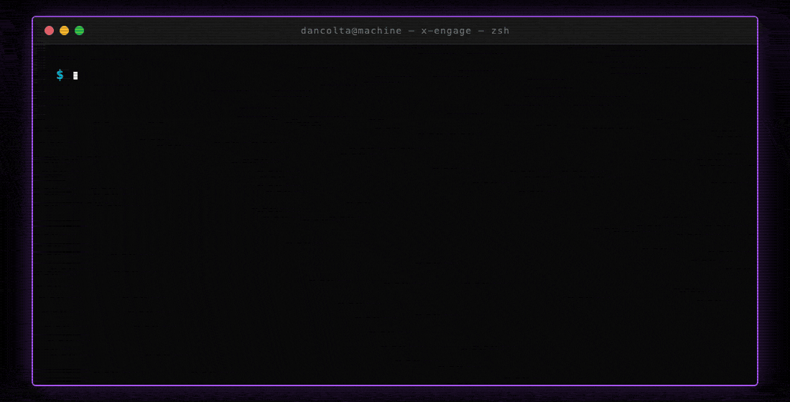

# x-comment

> Authority-build automation for X (Twitter) — drafts replies in your voice, queues them for your approval in chat, then publishes via Playwright on your logged-in session.

`x-comment` is a [Claude Code](https://claude.ai/code) skill that turns the reply-guy growth strategy into a reviewable pipeline. It fetches candidate posts from a list of tracked accounts and topic searches you define, drafts replies that match your voice profile, scores them against deterministic safety filters, and waits for your in-chat approval before posting anything.

It is built for **personal-brand operators** who already publish on X and want disciplined daily reply activity without becoming a bot or babysitting a queue.



---

## ⚠️ Before you install — read this

This tool drives a **logged-in browser session** on a real X account via Playwright. X's [automation rules](https://help.x.com/en/rules-and-policies/twitter-automation) prohibit certain automated activity. You are responsible for staying inside them.

- The defaults (10 replies/day, 24h per-handle cooldown, jittered cadence, human-typed input, single device fingerprint) are research-tuned to look like a person who reads X actively. They are **not a guarantee** that an account won't be limited.
- Hard caps are enforced in code (`guardrails.md`) and **cannot be loosened via config**. Even if `config/settings.yml` says 50/day, the code uses 25.
- If you crank volume or run multiple accounts, you will get flagged. Don't.
- Every reply goes through chat approval. There is **no fully autonomous mode**. This is by design.

If your account is a critical business asset and you're not okay with any incremental risk, use the [official X API](https://docs.x.com/x-api/getting-started/about-x-api) paid tier with write scope instead of Playwright.

---

## What it does

```
Build subqueries from accounts.yml (from:@handle) + topics.yml (keywords)
                       │
                       ▼
       For each subquery:
         bird_x.search_x()       ← X GraphQL via your session cookies, free, minute-precision timestamps
       → parse_bird_response() (+ timestamp preservation shim)
       → normalize_source_items()
       → signals.annotate_stream()    (relevance + freshness + engagement)
       → signals.prune_low_relevance()
       → dedupe.dedupe_items()
       → snippet.extract_best_snippet()
                       │
                       ▼
       Cross-subquery dedup + sort by local_rank_score
                       │
                       ▼
       Age window (5–60 min) + cooldown + seen-posts + follower bounds
                       │
                       ▼
       voice-profile.md + x-overlay.md + Claude CLI → draft reply
                       │
                       ▼
       safety lint + voice score
                       │
                       ▼
       SQLite queue ◄──┼──► Notion mirror (log only, optional)
                       │
                       ▼
       you, in chat: review · approve · redraft · kill
                       │
                       ▼
       Playwright posts to X (headed, humanized)
```

The discovery pipeline (`bird_x → normalize → signals → dedupe → snippet`) is vendored verbatim from the [`last30days`](https://github.com/YOUR-USER/last30days) skill into `scripts/lib/vendor/l30d/`, so candidate quality and ranking match what `/last30days` produces for X. Bird uses your browser session cookies (`AUTH_TOKEN` + `CT0` from `.env`) and runs as a Node subprocess — same auth model as your Playwright posting setup, zero API cost.

The reply-drafting voice is defined in `voice-profile.md` (or a local `voice-profile.personal.md` override). `x-overlay.md` layers X-specific constraints on top — character minimums, opener rotation, banned spam triggers, constructive-tone requirement (the Jan 2026 Grok ranker actively suppresses combative replies regardless of engagement).

## Quick start

### 1. Prerequisites

- macOS (the launchd plist is mac-flavored; on Linux swap for cron / systemd)
- Python 3.10+
- Node.js 22+ (the vendored `bird-search` reader runs on Node)
- [Claude Code](https://claude.ai/code) CLI on PATH
- A logged-in X account — you'll copy two session cookies (`auth_token` and `ct0`) into `.env`. **No paid API needed.**
- A Notion integration token + a database (optional — set `mirror_enabled: false` to skip)

### 2. Install

```bash
git clone https://github.com/YOUR-USER/x-comment.git
cd x-comment
pip install -r requirements.txt
playwright install chromium
```

### 3. Configure

```bash
cp .env.example .env                              # add AUTH_TOKEN + CT0 (required) + NOTION_TOKEN/NOTION_DB_ID (optional)
cp config/accounts.example.yml config/accounts.yml
cp config/topics.example.yml   config/topics.yml
cp config/settings.example.yml config/settings.yml
```

To grab `AUTH_TOKEN` and `CT0`:
1. Open **x.com** in Chrome, logged in
2. DevTools (Cmd+Opt+I) → **Application** tab → **Cookies → https://x.com**
3. Copy the **Value** column for `auth_token` (~40 chars) and `ct0` (~160 chars)
4. Paste into `.env` as `AUTH_TOKEN=...` and `CT0=...`

Cookies expire when you log out of x.com. Re-grab if `bird-search` starts returning empty results.

Edit each file:

- **`config/accounts.yml`** — handles you reply to often (5k–250k followers convert best per research)
- **`config/topics.yml`** — keyword searches mapped to topic buckets
- **`config/settings.yml`** — daily cap, timezone, posting windows, voice-match threshold
- **`voice-profile.md`** — your underlying voice (template ships generic; replace with your tone). Alternatively create `voice-profile.personal.md` (gitignored) and the skill prefers it.
- **`x-overlay.md`** — X-specific constraints (length floor, opener rotation, banned patterns)

### 4. Notion database (optional)

If you want a searchable log of drafts (Notion is **not** the approval surface — chat is), create a Notion DB with these properties (names are **case-sensitive, lowercase**):

| Property | Type | Notes |
|---|---|---|
| Name | Title | Auto-filled with `@author: source preview` |
| status | Select | Options: `pending`, `approved`, `publishing`, `published`, `failed`, `skipped`, `deferred` |
| author | Text | Source post author handle |
| draft | Text | Generated reply |
| final_text | Text | Optional — your edits land here, used instead of `draft` if set |
| post_text | Text | Source post text |
| post_url | URL | Source tweet URL |
| scanned_at | Date | When the draft was created |
| published_at | Date | When the reply was published |
| reason | Text | Filled on skip/fail/defer |

Share the DB with your Notion integration. Copy the DB ID from the URL into `.env` as `NOTION_DB_ID`. To skip Notion entirely, set `notion.mirror_enabled: false` in `config/settings.yml`.

### 5. Log in to X once (in the persistent profile Playwright will reuse)

This is the only time the browser opens visibly — after login, all subsequent publish runs are headless.

```bash
python3 -c "
from playwright.sync_api import sync_playwright
from pathlib import Path
import os
profile = os.path.expanduser('~/.x-comment/chrome-profile')
Path(profile).mkdir(parents=True, exist_ok=True)
with sync_playwright() as p:
    ctx = p.chromium.launch_persistent_context(profile, headless=False, viewport={'width':1280,'height':800})
    page = ctx.new_page()
    page.goto('https://x.com/login')
    input('Log in to X manually, then press Enter to close...')
    ctx.close()
"
```

### 6. Verify setup

```bash
python3 -m scripts.x_comment setup
```

Expected output:
```
[ok] X session cookies (AUTH_TOKEN + CT0) present
[ok] node on PATH (required for bird-search)
[ok] Notion env vars present
[ok] claude CLI on PATH
[info] Playwright profile dir: ~/.x-comment/chrome-profile
```

## Usage

The skill installs as `/x-comment` in Claude Code. From the CLI directly:

| Command | What it does |
|---|---|
| `python3 -m scripts.x_comment fetch` | Pull candidates, draft, queue (also mirrors to Notion if enabled) |
| `python3 -m scripts.x_comment review` | Show all pending drafts in chat-ready format |
| `python3 -m scripts.x_comment approve <ids\|all>` | Mark drafts approved |
| `python3 -m scripts.x_comment redraft <id> "<feedback>"` | Re-draft one row with your steer |
| `python3 -m scripts.x_comment kill <id>` | Reject a draft |
| `python3 -m scripts.x_comment publish` | Ship approved drafts via Playwright |
| `python3 -m scripts.x_comment status` | Counts, daily cap, paused state |

Typical day:

```
$ /x-comment fetch
fetch: drafted=4, skipped=11, rejected=2, candidates=17

$ /x-comment review
#a1b2c3d4  @builder_42 (12,400 followers) · 8min ago · score 0.91
  Source: "We doubled our revenue in 30 days using only AI."
  Draft:  "What was the baseline though. Doubling from 2k to 4k and from 200k to 400k are different conversations entirely."

#e5f6g7h8  @founder_99 (45,200 followers) · 22min ago · score 0.78
  Source: "Custom dev is dead, no-code wins."
  Draft:  "Depends on what you're building. The recurring SaaS items piling up in most teams are weekend-overnight territory now, anything load-bearing is still custom."

Reply with: approve <ids|all>, redraft <id>: <feedback>, kill <id>, or publish

$ /x-comment approve a1b2c3d4
approve: marked 1 draft(s) approved. Run `/x-comment publish` to ship.

$ /x-comment redraft e5f6g7h8: more direct, drop the comma splice
redraft #e5f6g7h8: score 0.84
  Draft: "Depends on what you're building. The SaaS subscriptions stacking up in most teams are weekend-overnight territory now. Anything load-bearing for the business is still custom."

$ /x-comment approve all
approve: marked 1 draft(s) approved. Run `/x-comment publish` to ship.

$ /x-comment publish
publish: published=2, failed=0, deferred=0
```

## Scheduling (optional)

If you want the **draft phase** to fire automatically on a schedule (publish is always manual):

```bash
cp assets/com.example.xcomment.fetch.plist ~/Library/LaunchAgents/
# edit the plist: replace path placeholders with your absolute paths
launchctl load ~/Library/LaunchAgents/com.example.xcomment.fetch.plist
```

The plist fires the drafter Tue–Thu at 8:30, 10:00, and 15:15 (matching the highest-engagement windows on X per Buffer + Sprout data). Drafts accumulate in your queue. Publishing remains 100% manual.

## Configuration reference

### `config/settings.yml`

| Key | Default | Notes |
|---|---|---|
| `daily_cap` | 10 | Code refuses values > 25 |
| `min_gap_between_publishes_sec` | 90 | Code floor: 30 |
| `voice_match_threshold` | 0.65 | Drafts below this never reach review |
| `tz` | `UTC` | Target audience TZ, for daily-cap reset |
| `posting_windows` | Tue–Thu 8–11am + 3pm | Research-backed peaks |
| `require_explicit_approval` | `true` | Code refuses to flip this false |
| `banned_terms` | `[]` | Terms that auto-reject any draft containing them (your custom blocklist — competitor names, ex-employer names, etc.) |

### `voice-profile.md` and `x-overlay.md`

Two files by design:

- **`voice-profile.md`** — *who you are*. Underlying voice DNA. Edit to make replies sound like you. (Or drop a `voice-profile.personal.md` next to it — it's gitignored and the skill prefers it.)
- **`x-overlay.md`** — *platform constraints*. Length floor, opener rotation, banned shapes derived from May 2026 X research. Edit when X behavior changes; don't touch your voice file.

This split lets you tune voice without breaking guardrails, and guardrails without breaking voice.

## Safety knobs

The following are **hardcoded ceilings** in `guardrails.md` and `scripts/lib/config.py`. Config cannot loosen them:

- 25 replies/day absolute panic ceiling
- 30s minimum publish gap
- 12h minimum per-handle cooldown
- 90 min maximum source-post age
- 280 char hard max (X limit)
- 50 char hard min (drafts also rejected below 80 by overlay)

Kill switches:

- `X_COMMENT_HALT=1` env var → halt at any pipeline stage
- `~/.x-comment/PAUSED` file → halt on publish runs
- Any safety signal (captcha, restriction language, suspended account) detected during `publish` → auto-write `PAUSED`, screenshot to `~/Downloads/x-incident-*.png`, exit code 2

## Anti-hallucination guarantees

- The drafter prompt receives **only** the source post text + voice files. No web fetch, no external context. The drafter cannot invent stats, quotes, or handles because it has nothing to invent from.
- Safety lint runs **after** draft generation and rejects anything matching banned shapes (negation-reframe, listicle-wisdom, banned openers, hashtags, URLs, extra @mentions, emoji, dashes, exclamation marks) plus your `banned_terms` from config.
- Voice score gates drafts below `voice_match_threshold` from ever reaching review.
- Publisher refuses to send any draft not explicitly `status='approved'` set by your chat command.

## Architecture

```
scripts/
├── x_comment.py            # CLI orchestrator
└── lib/
    ├── config.py           # .env + YAML loader, panic ceilings, SSL bootstrap
    ├── log.py              # JSON line logger
    ├── fetch.py            # Discovery pipeline (bird → normalize → signals → dedupe)
    ├── voice.py            # Claude CLI drafter + heuristic scorer
    ├── safety.py           # Deterministic lint (banned shapes)
    ├── state.py            # SQLite: drafts, cooldowns, seen, openers
    ├── notion_mirror.py    # Notion log (not approval surface)
    ├── publisher.py        # Playwright publish + safety scan
    └── vendor/
        ├── l30d/            # /last30days pipeline (verbatim): bird_x, normalize,
        │                    # signals, dedupe, snippet, relevance, schema, etc.
        └── l30d/vendor/bird-search/   # Node lib that reads X via session cookies
config/
├── *.example.yml           # tracked exemplars
└── *.yml                   # gitignored, your real config
voice-profile.md            # generic template (or your edits)
voice-profile.personal.md   # gitignored override, preferred if present
x-overlay.md                # X-platform constraints
guardrails.md               # hard caps + kill switches
SKILL.md                    # Claude Code skill manifest
```

## Why this exists

The "reply guy strategy" works. Top-performing X accounts in 2025–2026 grew via replies, not original posts (research summary: ~70% time on strategic replies to bigger accounts, ~30% original). But running it manually means 30–60 min/day of disciplined attention better spent building. Existing tools (scheduling-first products like Hypefury, Tweet Hunter, Typefully, Postwise) don't help with the actual reply-composition bottleneck.

`x-comment` automates the bottleneck (drafting + filtering) and keeps the part that should never be automated (judgment) in human hands.

## License

MIT. See [LICENSE](LICENSE).

## Contributing

PRs welcome for:
- Better safety detection patterns (`scripts/lib/safety.py`)
- Locale support beyond English
- Alternative LLM drafter backends (OpenAI, local models)
- Linux/cron scheduling parity

Not welcome:
- Raising the hardcoded panic ceilings
- Removing the chat-approval gate
- Multi-account support

These exist on purpose.
